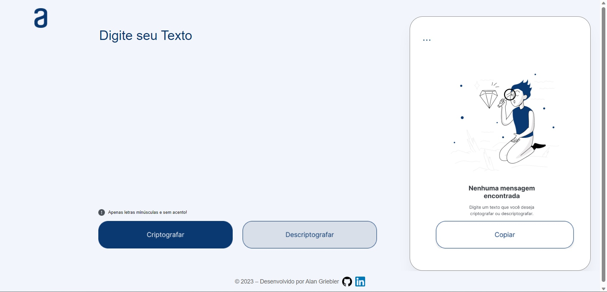

# Decodificador de Texto

<h3>Sobre</h3>

Uma aplicação que encriptografa mensagens digitadas e descriptografa mensagens encriptografadas por ele.

<h4>As "chaves" de criptografia utilizadas são:</h4>
<ul>
<li>A letra "e" é convertida para "enter."</li>
<li>A letra "i" é convertida para "imes."</li>
<li>A letra "a" é convertida para "ai."</li>
<li>
A letra "o" é convertida para "ober."</li>
<li>
A letra "u" é convertida para "ufat."</li>
<ul>

<h4>Requisitos:</h4>

- Deve funcionar apenas com letras minúsculas.

- Não devem ser utilizados letras com acentos nem caracteres especiais.

- Deve ser possível converter uma palavra para a versão criptografada e também retornar uma palavra criptografada para a versão original.

<h4>Por exemplo:</h4>

"gato" => "gaitober"

gaitober" => "gato"

A página deve ter campos para inserção do texto a ser criptografado ou descriptografado, e a pessoa usuária deve poder escolher entre as duas opções
O resultado deve ser exibido na tela.

<h3>Objetivo do projeto</h3>Atestar e solidificar o aprendizado adquirido durante o modúlo de JavaScript, em manipulação de paginás web utilizando Java Script.

<h4>Index.</h4>  

  
<h4>Encriptografando.</h4>
  

<h4>Descriptando.</h4>
  

<h2>Demonstração completa.</h2> 
Link: https://alanzzera.github.io/Decodificador-Texto/

<h3>Técnologias e recursos utilizados.</h3>
<ul>
  <li><h4>HTML5</h4>
      <ul>
          <li>Formulários.</li>
      </ul>
  <li><h4>CSS</h4>
       <ul>
          <li>Responsividade.</li>
          <li>Flex-Box.</li>
          <li>Media Queries.</li>
          <li>Estilização.</li>
      </ul>
  </li>
  <li><h4>JavaScript</h4>
      <ul>
          <li>DOM.</li>
          <li>Funções.</li>
          <li>Set Timeout</li>
          <li>Estruturas de repetição.</li>
      </ul>
  </li>
<ul>
